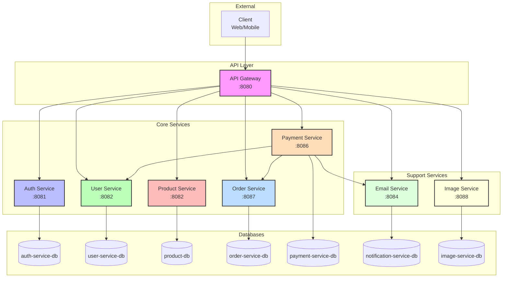
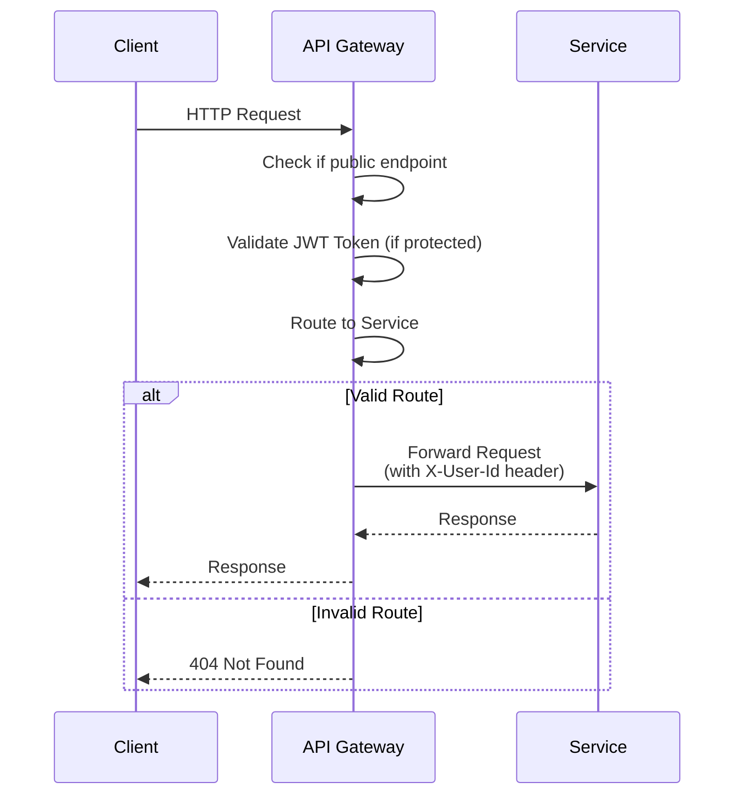
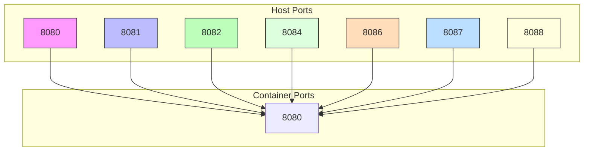
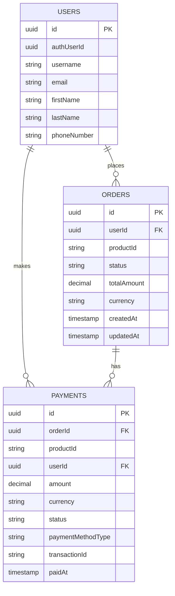
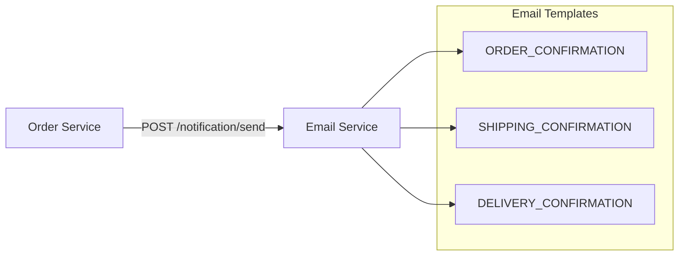

# System Architecture

## Services Overview

| Service | Port | Container | Database | Description |
|---------|------|-----------|----------|-------------|
| API Gateway | 8080 | api-gateway | - | Routes requests to services |
| Auth Service | 8081 | auth-service | auth-service-db | Authentication & authorization |
| User Service | 8082 | user-service | user-service-db | User profile management |
| Product Service | 8082 | product-service | product-db | Product catalog |
| Order Service | 8087 | order-service | order-service-db | Order management |
| Payment Service | 8086 | payment-service | payment-service-db | Payment processing |
| Email Service | 8084 | notification-service | notification-service-db | Email notifications |
| Image Service | 8088 | image-service | image-service-db | Image upload/storage |

## Architecture Diagram



## API Gateway Security

### Public Endpoints (No Authentication Required)

| Endpoint | Method | Description |
|----------|--------|-------------|
| /auth/** | ALL | Login, register, token validation |
| /products/** | GET | Browse products (view only) |
| /image/** | GET | View images |

### Protected endpoints (JWT Token Required)

All other endpoints require a valid JWT token in the `Authorization: Bearer {token}` header.

The API Gateway:
1. Validates the JWT token
2. Extracts `userId` from the token
3. Adds `X-User-Id` header to downstream service requests

## Request Flow



## Inter-Service Communication

```mermaid
graph LR
    subgraph "Synchronous (REST)"
        P-->|GET /order/{id}| O
        P-->|PUT /order/{id}/paid| O
        O-->|PUT /payment/order/{id}/refund| P
        O-->|GET /products/{id}| Pr
        O-->|GET /user/{id}| U
        O-->|POST /notification/send| E
    end
    
    subgraph "Service Names"
        P[Payment Service]
        O[Order Service]
        Pr[Product Service]
        U[User Service]
        E[Email Service]
    end
```

## Port Mapping



## Database Schema



## Email Notifications

The Order Service sends email notifications for the following events:

| Event | Template Code | When |
|-------|---------------|------|
| Payment Confirmation | ORDER_CONFIRMATION | When order status → PAID |
| Shipping Confirmation | SHIPPING_CONFIRMATION | When order status → SHIPPED |
| Delivery Confirmation | DELIVERY_CONFIRMATION | When order status → DELIVERED |
| Refund Confirmation | ORDER_CONFIRMATION | When order status → REFUNDED |



## Environment Variables

| Service | Variable | Default | Description |
|---------|----------|---------|-------------|
| Payment Service | ORDER_SERVICE_URL | http://order-service:8080 | Order service endpoint |
| Order Service | USER_SERVICE_URL | http://user-service:8080 | User service endpoint |
| Order Service | EMAIL_SERVICE_URL | http://notification-service:8080 | Email service endpoint |
| Order Service | PAYMENT_SERVICE_URL | http://payment-service:8080 | Payment service endpoint |
| Order Service | PRODUCT_SERVICE_URL | http://product-service:8082 | Product service endpoint |
| Auth Service | USER_SERVICE_URL | http://user-service:8080 | User service endpoint |
| Product Service | PAYMENT_SERVICE_URL | http://payment-service:8080 | Payment service endpoint |
