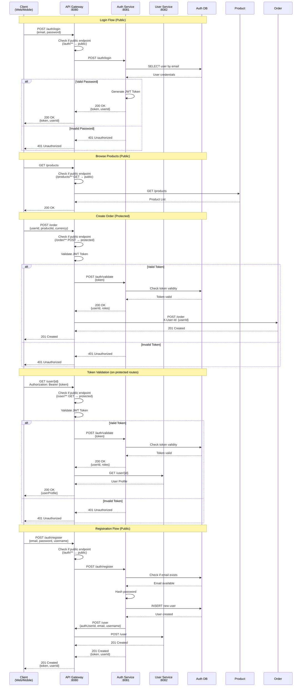
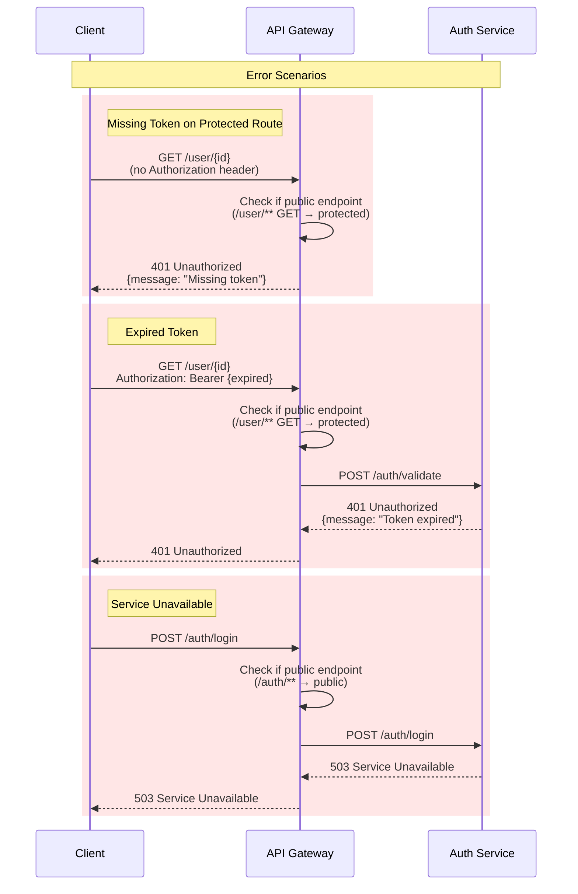

# Authentication Flow

## Overview

The authentication flow handles user login, token generation, and token validation.

## Public Endpoints

The following endpoints are accessible without a valid bearer token:

| Endpoint | Method | Description |
|----------|--------|-------------|
| /auth/** | ALL | Login, register, token validation |
| /products/** | GET | Browse products (view only) |
| /image/** | GET | View images |

All other endpoints require a valid JWT token in the `Authorization: Bearer {token}` header.

## Sequence Diagram

## Error Handling

## Service Communication

| From | To | Method | Endpoint | Purpose |
|------|-----|--------|----------|---------|
| API Gateway | Auth Service | POST | /auth/login | User login |
| API Gateway | Auth Service | POST | /auth/register | User registration |
| API Gateway | Auth Service | POST | /auth/validate | Token validation |
| Auth Service | User Service | POST | /user | Create user profile |

## Database Operations

| Operation | Table | Description |
|-----------|-------|-------------|
| SELECT | users | Get user by email |
| INSERT | users | Create new user |
| SELECT | tokens | Validate JWT token |
