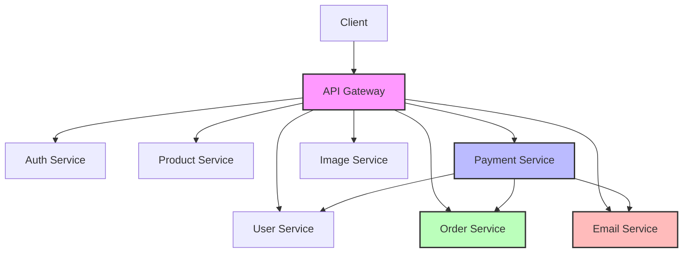

# System Communication Diagrams

## Overview

This document contains UML diagrams for the microservices architecture. The diagrams are split into separate files for better readability.

## Quick Links

| Diagram | Description |
|---------|-------------|
| [Architecture](architecture.md) | High-level system architecture and service relationships |
| [Auth Flow](auth_flow.md) | Authentication and authorization sequence |
| [Order Flow](order_flow.md) | Order creation and management |
| [Payment Flow](payment_flow.md) | Payment processing and refunds |

## Services

| Service | Port | Container | Database |
|---------|------|-----------|----------|
| API Gateway | 8080 | api-gateway | - |
| Auth Service | 8081 | auth-service | auth-service-db |
| User Service | 8082 | user-service | user-service-db |
| Product Service | 8082 | product-service | product-db |
| Order Service | 8087 | order-service | order-service-db |
| Payment Service | 8086 | payment-service | payment-service-db |
| Email Service | 8084 | notification-service | notification-service-db |
| Image Service | 8088 | image-service | image-service-db |

## Communication Summary

## Key Interactions

1. **Client → API Gateway**: All external requests go through the gateway
2. **API Gateway → Services**: Routes requests based on URL path
3. **Payment → Order**: Updates order status (PAID, REFUNDED)
4. **Payment → User**: Fetches user email for notifications
5. **Payment → Email**: Sends payment confirmation emails

## Viewing the Diagrams

These diagrams use Mermaid syntax and can be viewed in:

- **GitHub/GitLab**: Native markdown rendering
- **VS Code**: Install "Mermaid" extension
- **Online**: [mermaid.live](https://mermaid.live)
- **IntelliJ IDEA**: Built-in Mermaid support
