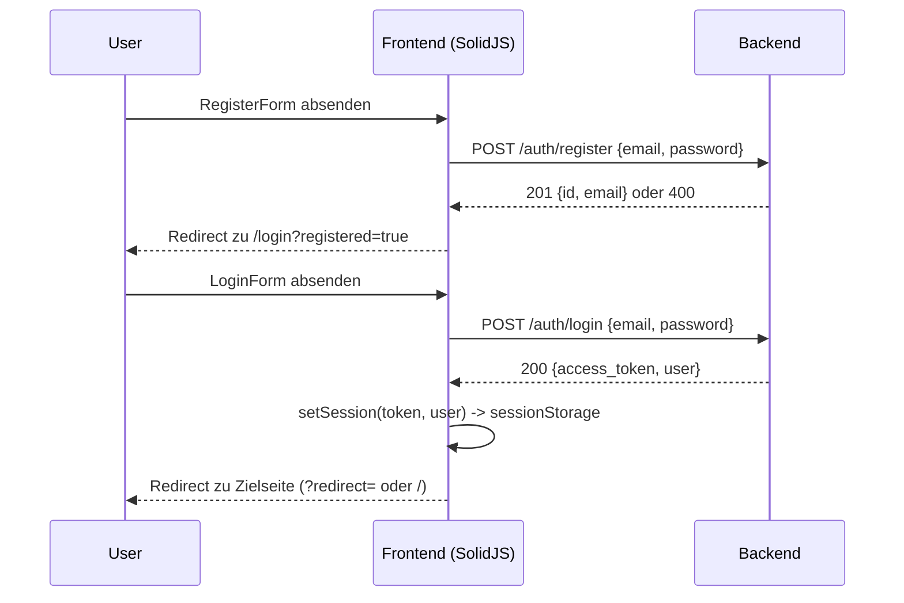
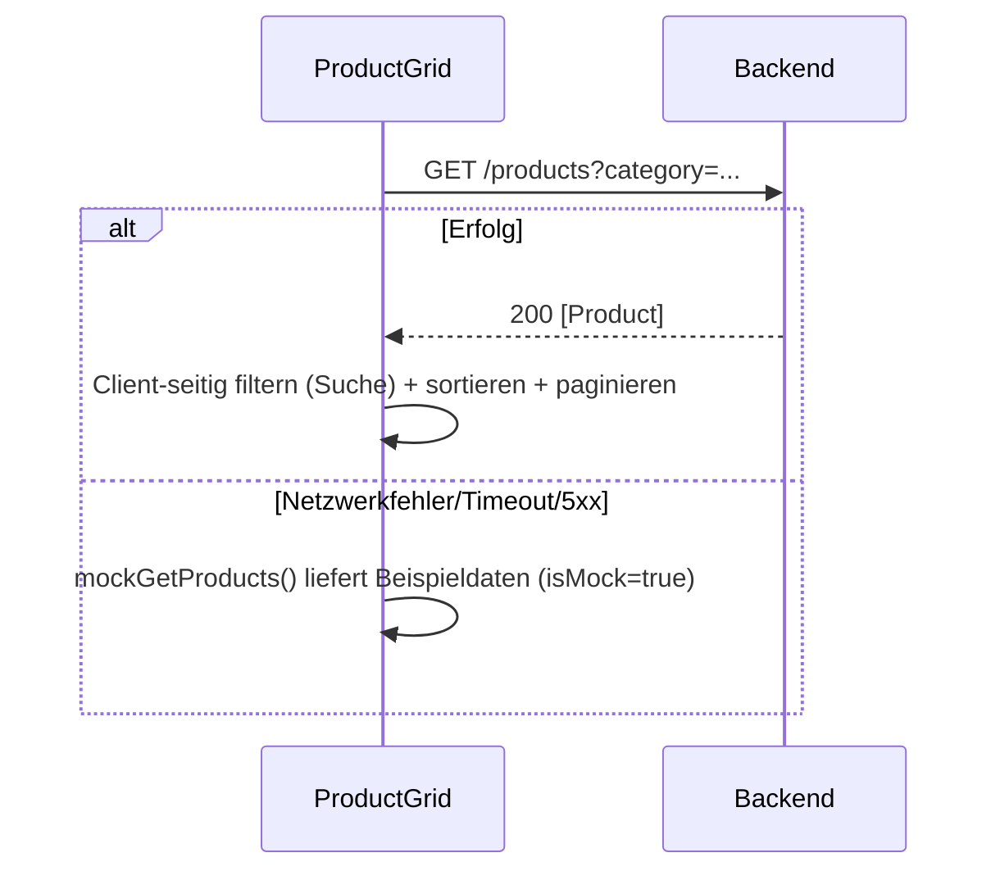
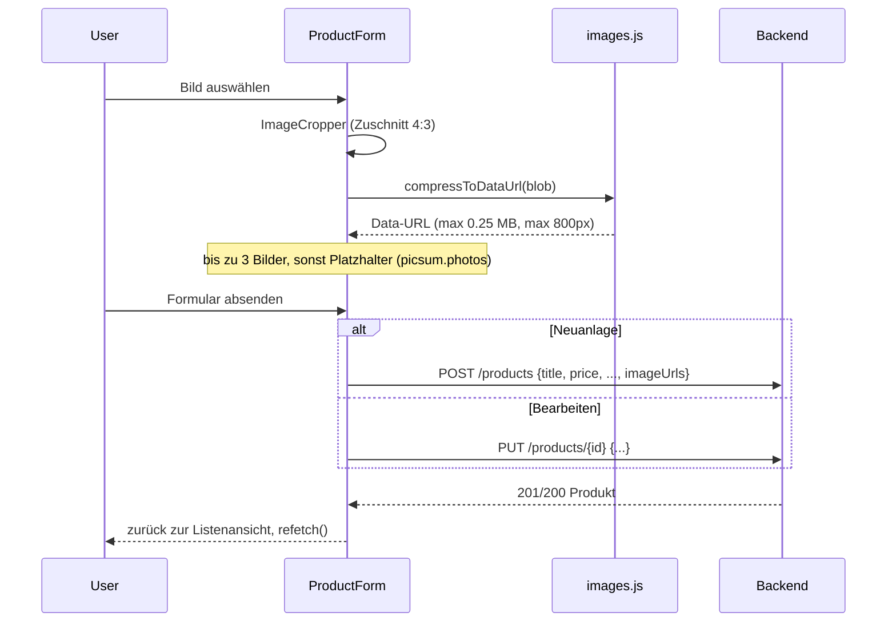
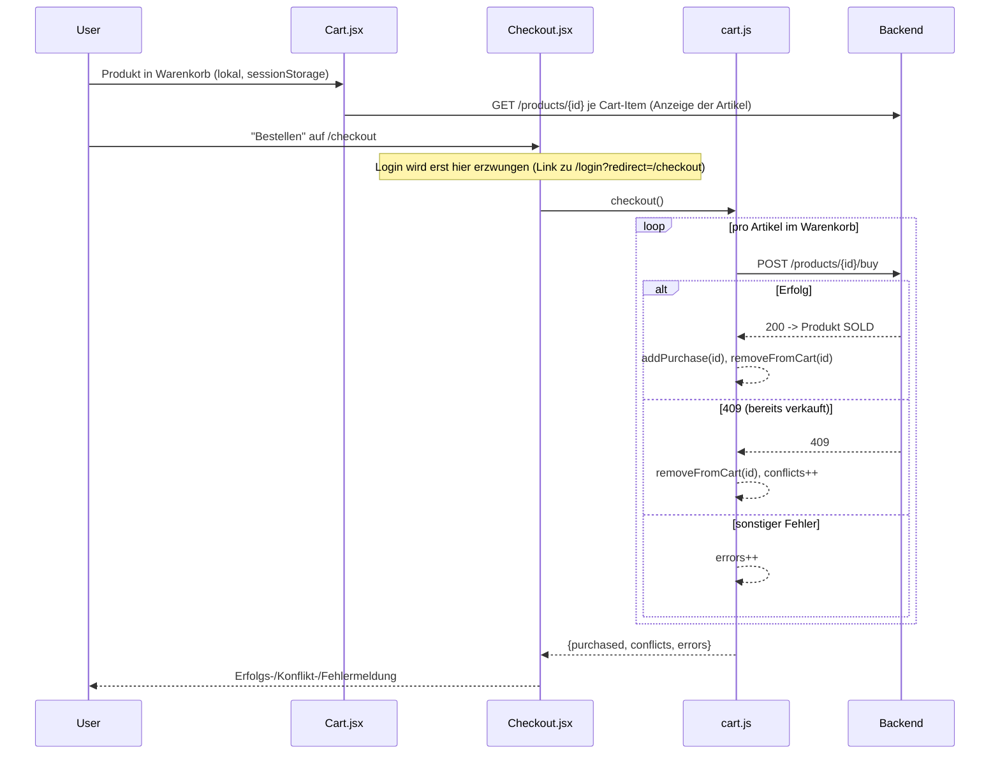

# Frontend – API-Übersicht

Dieses Dokument beschreibt, welche Backend-APIs das Frontend (`frontend/`, Astro + SolidJS) aufruft, wie die Request-Flows ablaufen und wie die einzelnen Endpunkte aussehen.

> **Hinweis zur Abweichung von `architecture.md`:** Die übrige Doku (`architecture.md`, `api_examples.md`) beschreibt eine vollständige Microservice-Landschaft mit API-Gateway, Auth-, User-, Product-, Order-, Payment- und Email-Service. Das Frontend in diesem Branch (`prodcut-und-order`) spricht aktuell **nicht** gegen dieses Gateway, sondern gegen ein eigenständiges, einfaches `test-backend` (`frontend/test-backend/server.js`), das nur die Routen `/auth`, `/products` und `/users` nachbildet. Es gibt **keinen** separaten Order- oder Payment-Call vom Frontend aus – ein Kauf läuft direkt über `POST /products/{id}/buy`. Order/Payment/Email-Flows aus `architecture.md` sind im Frontend (noch) nicht verdrahtet.

## 1. Architektur & Routing

- **Stack:** Astro (SSR, `output: "server"`, Node-Adapter) mit SolidJS-Inseln (`client:load`) für interaktive Komponenten.
- **Zwei Aufrufpfade** für Backend-Calls, siehe `frontend/src/lib/api.js`:
  - **Browser (Client-Komponenten):** `fetch("/api" + path)` → Vite-Dev-Proxy bzw. Reverse-Proxy leitet `/api/*` an das Backend weiter und entfernt das `/api`-Präfix. Damit erscheinen Frontend und Backend für den Browser als eine Origin (kein CORS nötig).
  - **SSR (Astro-Seiten, z. B. `product/[id].astro`):** ruft `process.env.BACKEND_TARGET` (Default `http://localhost:8090`) **direkt** auf, ohne Proxy.
- **Proxy-Konfiguration** (`astro.config.mjs`):
  ```js
  proxy: {
    "/api": {
      target: process.env.BACKEND_TARGET ?? "http://localhost:8080",
      changeOrigin: true,
      rewrite: (path) => path.replace(/^\/api/, ""),
    },
  }
  ```
- **Docker-Setup** (`docker-compose.yml`): `frontend` zeigt standardmäßig auf den Service `test-backend:8090` (überschreibbar via `BACKEND_TARGET_OVERRIDE`, z. B. um stattdessen gegen das echte API-Gateway zu testen).
- **Timeout:** Jeder Request hat ein Client-seitiges Timeout von 5000 ms (`AbortController`).
- **Fallback auf Mock-Daten:** Bei Netzwerkfehlern, Timeouts oder 5xx-Antworten liefern `getProducts`/`getProduct` automatisch Beispieldaten aus `lib/mockData.js` zurück (`isMock: true`), damit die UI auch ohne Backend funktionsfähig bleibt (z. B. für Präsentationen).

## 2. Zentrale Frontend-Module

| Datei | Zweck |
|---|---|
| `src/lib/api.js` | Zentraler `apiFetch`-Wrapper (Timeout, Error-Mapping, Mock-Fallback) + alle Endpunkt-Funktionen |
| `src/lib/auth.js` | Session-Verwaltung (`sessionStorage`), JWT-Decoding (ohne Signaturprüfung), `Authorization`-Header-Helper |
| `src/lib/cart.js` | Warenkorb & Kaufhistorie rein clientseitig (`sessionStorage`), orchestriert den Checkout (mehrere `buyProduct`-Calls) |
| `src/lib/images.js` | Bildkompression/-umwandlung in Data-URLs vor dem Senden an `createProduct`/`updateProduct` (kein eigener Upload-Endpunkt) |

### Fehlerbehandlung (`errorMessage`, `apiFetch`)

- HTTP-Status `401` → Session wird automatisch gelöscht (`clearSession`), Nutzer muss sich neu einloggen.
- HTTP-Status `204` → `null` (kein Body).
- Mapping auf deutsche Fehlertexte: `401` „Sitzung abgelaufen“, `404` „Nicht gefunden“, `409` „Produkt bereits verkauft“, `400` „Ungültige Eingabe“, Netzwerk/Timeout/5xx → „Service vorübergehend nicht erreichbar“. Komponenten können Status-spezifische Overrides übergeben (z. B. `400` beim Login → „E-Mail oder Passwort falsch“).

## 3. Endpunkte

Basis-Pfad aus Sicht des Browsers: `/api/...` (wird zum Backend-Root umgeschrieben). Alle Pfade unten sind die Backend-Pfade (nach Proxy-Rewrite).

| Methode | Pfad | Auth | Frontend-Funktion | Aufgerufen von |
|---|---|---|---|---|
| `POST` | `/auth/register` | – | `registerUser(email, password)` | `RegisterForm.jsx` |
| `POST` | `/auth/login` | – | `loginUser(email, password)` | `LoginForm.jsx` |
| `GET` | `/products` bzw. `/products?category=...` | – | `getProducts(category)` | `ProductGrid.jsx`, `MyListings.jsx` |
| `GET` | `/products/{id}` | – | `getProduct(id)` | `ProductDetail.jsx`, `product/[id].astro` (SSR-Vorabcheck), `cart.js` (`loadCartItems`), `MyOrders.jsx` |
| `POST` | `/products` | Bearer-Token | `createProduct(data)` | `ProductForm.jsx` (Neuanlage) |
| `PUT` | `/products/{id}` | Bearer-Token | `updateProduct(id, data)` | `ProductForm.jsx` (Bearbeiten) |
| `DELETE` | `/products/{id}` | Bearer-Token | `deleteProduct(id)` | `ProductDetail.jsx` (Löschen, mit Confirm-Dialog) |
| `POST` | `/products/{id}/buy` | Bearer-Token | `buyProduct(id)` | `cart.js` → `checkout()`, aufgerufen aus `Checkout.jsx` |
| `GET` | `/users/{id}` | optional (Header wird mitgeschickt, Backend ignoriert ihn aktuell) | `getSeller(sellerId)` | `ProductDetail.jsx` (Verkäuferanzeige; Fehler werden geschluckt → „Unbekannt“) |

Geschützte Endpunkte erwarten den Header `Authorization: Bearer <token>` (`authHeader()` in `auth.js`).

### Details zu einzelnen Endpunkten (laut `test-backend/server.js`)

**`POST /auth/register`**
- Body: `{ email, password }`
- 201: `{ id, email }`
- 400, wenn E-Mail/Passwort fehlen oder E-Mail bereits vergeben.

**`POST /auth/login`**
- Body: `{ email, password }`
- 200:
  ```json
  {
    "access_token": "<jwt>",
    "token_type": "Bearer",
    "expires_in": 3600,
    "user": { "id": 1, "username": "max_mueller", "email": "max@example.com" }
  }
  ```
- 400 bei ungültigen Daten.
- Das Frontend akzeptiert zusätzlich ein Legacy-Format `{ token }` (`normalizeLoginResponse` in `auth.js`) und liest dann `id`/`email`/`username` aus dem JWT-Payload (Feld `sub` muss numerisch sein).

**`GET /products`**
- Optionaler Query-Parameter `category`.
- 200: Array von Produkten.

**`GET /products/{id}`**
- 200: Produktobjekt, 404 wenn nicht vorhanden.

**`POST /products`** (Auth erforderlich)
- Body: `{ title, description?, price, category?, imageUrls?: string[] }`
- `sellerId` wird serverseitig aus dem Token gesetzt (Client schickt es zwar mit, Backend überschreibt es korrekt aus dem Token).
- 201: vollständiges Produktobjekt mit `status: "AVAILABLE"`, `createdAt`.
- 400 bei fehlendem Titel oder Preis ≤ 0.

**`PUT /products/{id}`** (Auth erforderlich, nur Owner)
- Body: beliebige Teilmenge von `{ title, description, price, category, imageUrls }`.
- 403, wenn `sellerId` des Produkts ≠ eingeloggter User.
- 404, wenn Produkt nicht existiert.

**`DELETE /products/{id}`** (Auth erforderlich, nur Owner)
- 204 bei Erfolg, 403/404 analog zu `PUT`.

**`POST /products/{id}/buy`** (Auth erforderlich)
- Markiert Produkt als `SOLD`.
- 409, wenn bereits verkauft (`status === "SOLD"`).
- 404, wenn Produkt nicht existiert.
- Es findet **kein separater Order- oder Payment-Aufruf** statt – „Kauf“ ist im Frontend gleichbedeutend mit „Produktstatus auf SOLD setzen“.

**`GET /users/{id}`**
- 200: `{ id, username, email }` (öffentliches Subset).
- 404, wenn User nicht existiert.

## 4. Datenmodelle (wie vom Frontend konsumiert)

**Product**
```json
{
  "id": 1,
  "title": "iPhone 15 Pro",
  "description": "string|null",
  "price": 950,
  "category": "Elektronik",
  "sellerId": 1,
  "status": "AVAILABLE | SOLD",
  "imageUrls": ["https://..."],
  "createdAt": "ISO-8601"
}
```

**Session (Frontend-intern, `sessionStorage`)**
```json
{
  "token": "<jwt>",
  "user": { "id": 1, "email": "max@example.com", "username": "max_mueller" }
}
```

**Cart / Purchases (`sessionStorage`, nur IDs)**
- `lp_cart`: Array von Produkt-IDs im Warenkorb.
- `lp_purchases`: Array von Produkt-IDs, die erfolgreich gekauft wurden (Kaufhistorie).

## 5. Flows

### 5.1 Registrierung & Login



- Bei Netzwerk-/Timeout-Fehler beim Login zeigt `LoginForm.jsx` einen "Mit Demo-Nutzer fortfahren"-Button (setzt eine Mock-Session ohne Backend-Call) – nur für Präsentationszwecke.
- `AuthGuard.jsx` schützt Seiten clientseitig: kein Token in `sessionStorage` → Redirect zu `/login`.

### 5.2 Produkte durchsuchen (Startseite, `ProductGrid.jsx`)



- Kategorie-Filter wird server-seitig (`?category=`) angewendet, Suche/Sortierung/Pagination passieren client-seitig.

### 5.3 Produktdetailseite (`product/[id].astro` + `ProductDetail.jsx`)

```mermaid
sequenceDiagram
    participant Astro as Astro SSR
    participant FE as ProductDetail (Browser)
    participant API as Backend

    Astro->>API: GET /products/{id}  (Vorab-Check, direkt, ohne /api-Proxy)
    Astro-->>Astro: 404 -> sofortige 404-Response der Seite
    Note over Astro: Bei Netzwerkfehler wird trotzdem weitergerendert

    FE->>API: GET /products/{id}  (erneuter Call im Browser über /api)
    FE->>API: GET /users/{sellerId}  (sobald sellerId bekannt; Fehler werden ignoriert)
    FE-->>FE: isOwner = currentUser.id === product.sellerId
    FE-->>FE: canAddToCart = status === AVAILABLE && !isOwner
```

- Löschen: `DELETE /products/{id}` nach Bestätigungsdialog → Redirect zu `/my-listings`.
- "Bearbeiten" verlinkt auf `/my-listings?edit={id}`, öffnet dort automatisch das Formular.

### 5.4 Anzeige erstellen / bearbeiten (`MyListings.jsx` + `ProductForm.jsx`)



- Bilder werden **nicht** hochgeladen, sondern als Base64-Data-URLs direkt im Produkt-JSON mitgeschickt (kein Image-Service angebunden).
- `MyListings.jsx` lädt aktuell **alle** Produkte (`GET /products`) und filtert client-seitig nach `sellerId` – es gibt keinen eigenen "meine Anzeigen"-Endpunkt.

### 5.5 Warenkorb & Checkout (`Cart.jsx`, `Checkout.jsx`, `cart.js`)



- Adress- und Zahlart-Formular auf der Checkout-Seite ist reine Demo-UI (Werte werden nicht an das Backend geschickt).
- Es gibt **keinen Order-Service-Aufruf**: ein "Kauf" = direkter `POST /products/{id}/buy` pro Artikel, sequentiell.

### 5.6 Kaufhistorie (`MyOrders.jsx`)

- Liest Produkt-IDs aus `lp_purchases` (`sessionStorage`, nur im aktuellen Tab vorhanden) und lädt für jede ID `GET /products/{id}` einzeln nach. Kein eigener Order-Endpunkt.

## 6. Bekannte Lücken / Abweichungen gegenüber der Ziel-Architektur

- Kein Order-/Payment-/Email-Service angebunden – Kauf- und Bestellhistorie sind rein clientseitig (`sessionStorage`) und gehen bei Tab-Schließung verloren.
- `GET /users/{id}` wird zwar mit Auth-Header aufgerufen, das `test-backend` prüft diesen aber nicht.
- Keine echte Bild-Upload-API; Bilder werden als komprimierte Data-URLs in `imageUrls` gespeichert (Payload-Limit ~0,75 MB pro Anzeige, Backend-Body-Limit liegt bei 10 MB).
- `MyListings.jsx` hat keinen serverseitigen Filter nach Verkäufer, sondern lädt alle Produkte.

## 7. Abweichungen: echter Product Service vs. Frontend

Der Vergleich oben (Abschnitte 1–6) bezieht sich auf das `test-backend`. Es gibt aber auch einen **echten** Product Service (`product_service/`, Spring Boot, Paket `group5.ebay2.product`), der hinter dem API-Gateway läuft. Die ursprünglich gefundenen Mismatches wurden **im Product Service selbst** behoben (Frontend wurde dabei als maßgeblich behandelt und nicht verändert). `auth_service`, `api_gateway` und `order_service` waren explizit **out of scope** und wurden nicht angefasst – verbleibende Lücken dort sind separat dokumentiert (7.5).

### 7.1 Behoben: Produkt-/Seller-IDs sind jetzt `Long` statt `UUID`

`Product.id` und `Product.sellerId` waren `UUID` (`@GeneratedValue(strategy = GenerationType.UUID)`), das Frontend rechnet aber durchgängig mit `Number` (`cart.js`, `ProductDetail.jsx` Owner-Check, `ProductForm.jsx`). `Number("00000000-...")` ergibt `NaN` – Warenkorb und Besitzer-Erkennung wären mit UUIDs nicht funktionsfähig gewesen.

**Fix:** `Product.id`/`sellerId` sind jetzt `Long` (`GenerationType.IDENTITY`), `ProductRepository`, `ProductController` und `ProductService` wurden entsprechend umgestellt; `DataInitializer`-Seed-Daten nutzen jetzt einfache `Long`-Werte (`1L`–`4L`) statt `UUID.fromString(...)`. Das passt auch zum eigenen Testfixture `product_service/requests/requests.http`, das von jeher numerische IDs (`/products/1`, `"sellerId": 1`) verwendet hatte.

**Bekannte Restlücke (out of scope):** `auth_service`/`User.id` ist weiterhin `UUID`, ebenso der `userId`-Claim im JWT. Der vom Gateway gesetzte `X-User-Id`-Header trägt also nach wie vor eine UUID – die Owner-/Identitäts-Kette ist daher erst dann vollständig stimmig, wenn auch `auth_service` auf numerische IDs umgestellt wird (separate Aufgabe).

### 7.2 `X-User-Id`-Header bleibt Pflicht (bewusst beibehalten)

Schreibende Endpunkte (`createProduct`, `updateProduct`, `deleteProduct`, `buyProduct`) lesen die Identität weiterhin ausschließlich aus dem Pflicht-Header `X-User-Id` (jetzt vom Typ `Long`), den das API-Gateway (`AuthFilter.java`) aus dem validierten JWT setzt. Es wurde **bewusst keine** eigene JWT-Dekodierung in `product_service` ergänzt – der Service ist weiterhin dafür ausgelegt, hinter dem echten Gateway zu laufen; das Frontend muss dafür über das Gateway (Port 8080) sprechen, nicht direkt gegen `product-service:8082`.

### 7.3 Behoben: `POST /products/{id}/buy` benötigt keinen Request-Body mehr

Vorher verlangte `BuyProductDto` zwingend `paymentMethodType` und `currency`, das Frontend (`api.js: buyProduct(id)`) sendet aber **keinen Body**. Das hätte zu 400 Bad Request statt einem erfolgreichen Kauf geführt.

**Fix:** `BuyProductDto` wurde komplett entfernt, `POST /products/{id}/buy` hat keinen Request-Body mehr. `buyProduct(productId, buyerId)` prüft weiterhin den Bestand atomar (`decrementQuantity`), setzt den Status auf `SOLD` bei `quantity == 0` und lehnt den Kauf des eigenen Produkts mit `403` ab.

### 7.4 Behoben: Payment-Service-Aufruf entfernt, Order-Service-Aufruf wieder eingebaut (jetzt mit `Long`-IDs)

Der ursprüngliche `buyProduct()` rief synchron `PaymentClient.createOrder()` (Order Service) und `PaymentClient.processPayment()` (Payment Service) auf. Der Payment Service existiert im Projekt nicht mehr (`docker/payment-service.yml` mountet einen gelöschten Ordner – verschoben nach `old-services/payment_service`) und wurde bewusst aus dem Kauf-Flow entfernt.

`order_service` setzte zunächst zwingend `UUID` für `productId`/`userId` voraus (`OrderDto.CreateRequest`, `Order`-Entity), was nach der ID-Typ-Umstellung (7.1) inkompatibel zu `product_service` gewesen wäre. **`order_service` wurde daraufhin in einem eigenen Schritt ebenfalls auf `Long` für `productId`/`userId` umgestellt** (`Order.java`, `OrderDto.java`, `OrderRepository.java`, `OrderController.java`, `OrderService.java`, `ProductServiceClient.java`/`ProductDto.java`, `UserServiceClient.java`/`EmailServiceClient.java`) – Order behält nur seine eigene Primärschlüssel-`id` als `UUID` (rein interne Korrelations-ID, vom Frontend nirgends gelesen).

**Fix:** `PaymentClient.java` wurde durch `OrderClient.java` ersetzt (nur noch `createOrder(userId, productId, currency)`, ohne Payment-Call). `buyProduct()` ruft nach der Bestandsänderung synchron `order_service` auf (`POST /order`, neue Config `services.order.url`), mit fester Default-`currency = "EUR"`, da das Frontend keine Währung mitschickt. Schlägt der Order-Call fehl, wird die Bestandsänderung kompensierend zurückgerollt (wie zuvor beim Payment-Call). `BuyProductResponse` enthält wieder `orderId`/`orderStatus` zusätzlich zu `productId`, `productTitle`, `price`, `remainingQuantity`.

**Bekannte Restlücke:** `order_service` ruft seinerseits `user_service` auf (für E-Mail-Bestätigungen via `UserServiceClient`/`EmailServiceClient`), und `user_service`/`auth_service` sind weiterhin `UUID`-basiert (out of scope). Diese Aufrufe laufen also mit einer `Long`-User-ID gegen einen `UUID`-Endpunkt und liefern keinen Treffer (E-Mail-Versand degradiert dadurch geräuschlos, kein Absturz) – exakt dasselbe Muster wie bei `X-User-Id`/`auth_service` in 7.2.

### 7.5 Behoben: Gateway-Routing für `/products/**` (und 5 weitere Routen)

`StripPrefix=1` entfernte das erste Pfadsegment, bevor der Request an den jeweiligen Service weitergeleitet wurde (`/products/123` → `/123`). `ProductController` (und mit demselben Muster: `order_service`, `user_service`, `image_service`, `notification_service`, `payment_service`) tragen ihr Ressourcen-Präfix aber selbst in den `@*Mapping`-Pfaden – nur `auth_service` ist ohne Präfix geschrieben und passte zu `StripPrefix=1`.

**Fix:** `StripPrefix=1` wurde in `api_gateway/src/main/resources/application.yml` bei allen Routen außer `auth-service` entfernt. Das betrifft technisch mehr als nur `product_service`, war aber nötig, damit `/products/**` über das echte Gateway überhaupt erreichbar ist – Service-Code wurde dafür nirgends angefasst.

### 7.6 Weiterhin offen, da out of scope (`auth_service`)

- **Login/Register-Contract passt nicht zum echten `auth_service`:** Erwartet `{ emailOrUsername, password }` bzw. `{ username, email, password }` und antwortet mit `{ accessToken, message }` (kein `user`-Objekt) – inkompatibel zu `lib/api.js`/`auth.js`. Nicht behoben, da `auth_service` out of scope ist.
- **`X-User-Id`/`userId` bleiben `UUID` in `auth_service`/`user_service`:** Die Long-Umstellung in `product_service`/`order_service` setzt voraus, dass die aufrufende Identität eine numerische ID ist. Solange `auth_service`/`user_service` UUIDs ausgeben, laufen `X-User-Id`-Header und `user_service`-Aufrufe ins Leere (siehe 7.2, 7.4).
- **403 ohne deutsche Fehlermeldung:** `errorMessage()` in `lib/api.js` kennt keinen Fall für `403`; das ist Frontend-Code und wurde nicht verändert (Frontend ist maßgeblich/unverändert).

### 7.7 Behoben: Bild-Spalte zu klein für Data-URLs

`imageUrls` war ohne `length`/`@Lob`-Override auf `image_url` gemappt → Hibernate-Default `VARCHAR(255)`. Das Frontend speichert dort komprimierte Base64-Data-URLs (mehrere hundert KB Text).

**Fix:** Spalte ist jetzt explizit `columnDefinition = "TEXT"`.

### Zusammenfassung

| Bereich | Status nach Anpassung |
|---|---|
| `GET /products`, `GET /products/{id}` | Kompatibel, `id`/`sellerId` jetzt `Long` |
| `POST/PUT/DELETE /products` | Kompatibel, sofern Aufruf über das echte Gateway läuft (`X-User-Id` weiterhin Pflicht, Typ jetzt `Long`) |
| `POST /products/{id}/buy` | Kompatibel – kein Body mehr nötig, kein Payment-Call mehr; erzeugt wieder eine echte Order (`order_service`, jetzt `Long`-IDs) |
| Bild-Upload als Data-URL | Kompatibel – Spalte ist jetzt `TEXT` |
| Gateway-Routing (6 Routen) | Kompatibel – `StripPrefix=1` entfernt, nur `auth-service` behält es |
| `POST /auth/login`, `POST /auth/register` | **Weiterhin inkompatibel** (out of scope: `auth_service`) |
| `X-User-Id` / `user_service`-Aufrufe aus `order_service` | **Weiterhin inkompatibel** (liefert `UUID`, `Long` erwartet – out of scope: `auth_service`/`user_service`) |