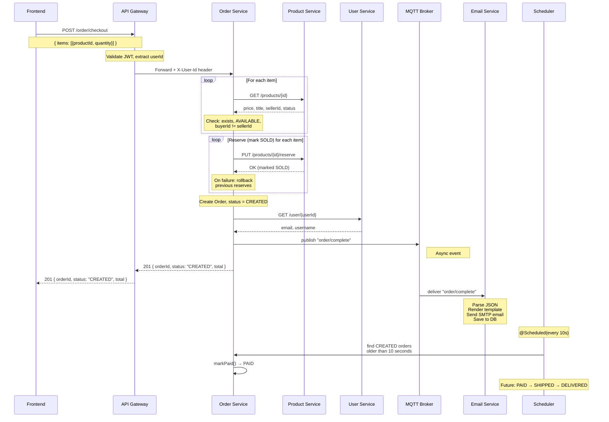
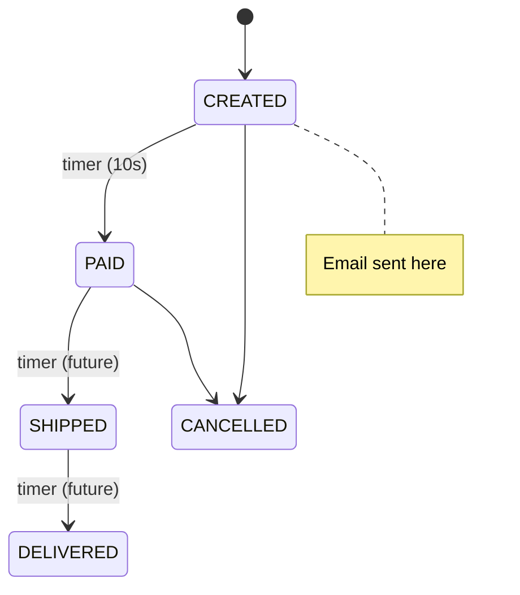

## Event-Status Mapping

| Order Status | MQTT Event | Email Template | When |
|-------------|------------|----------------|------|
| CREATED | `order/complete` | ORDER_CONFIRMATION | Immediately after creation |
| PAID | *(future)* | PAYMENT_CONFIRMATION | 10s after CREATED |
| SHIPPED | *(future)* | SHIPPING_CONFIRMATION | 10s after PAID |
| DELIVERED | *(future)* | DELIVERY_CONFIRMATION | 10s after SHIPPED |
