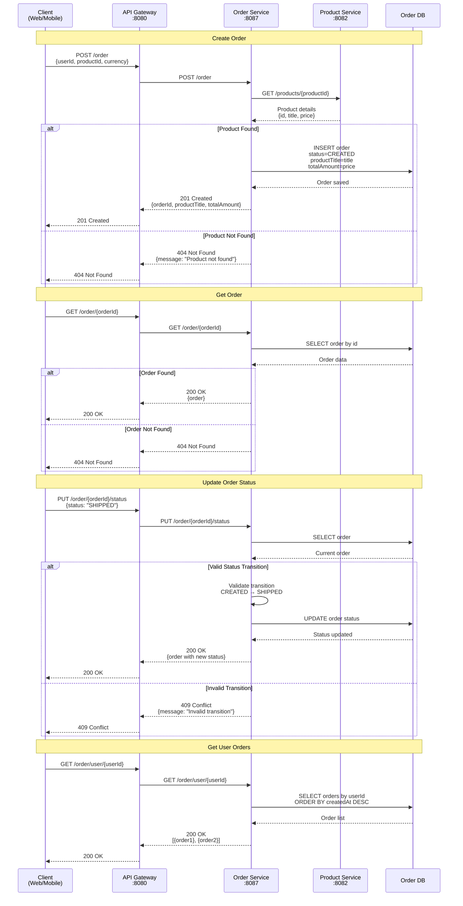
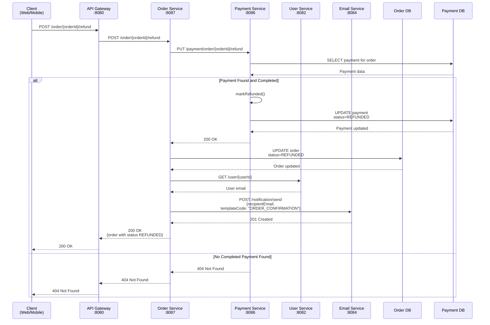
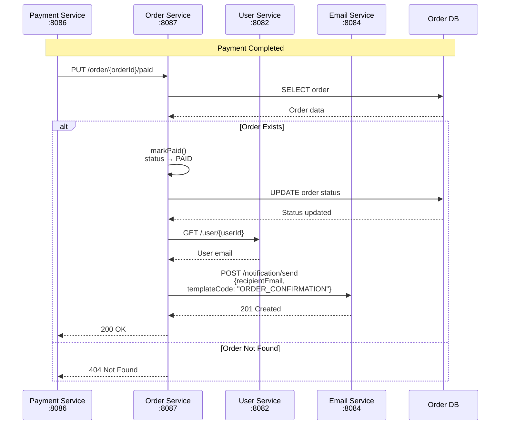
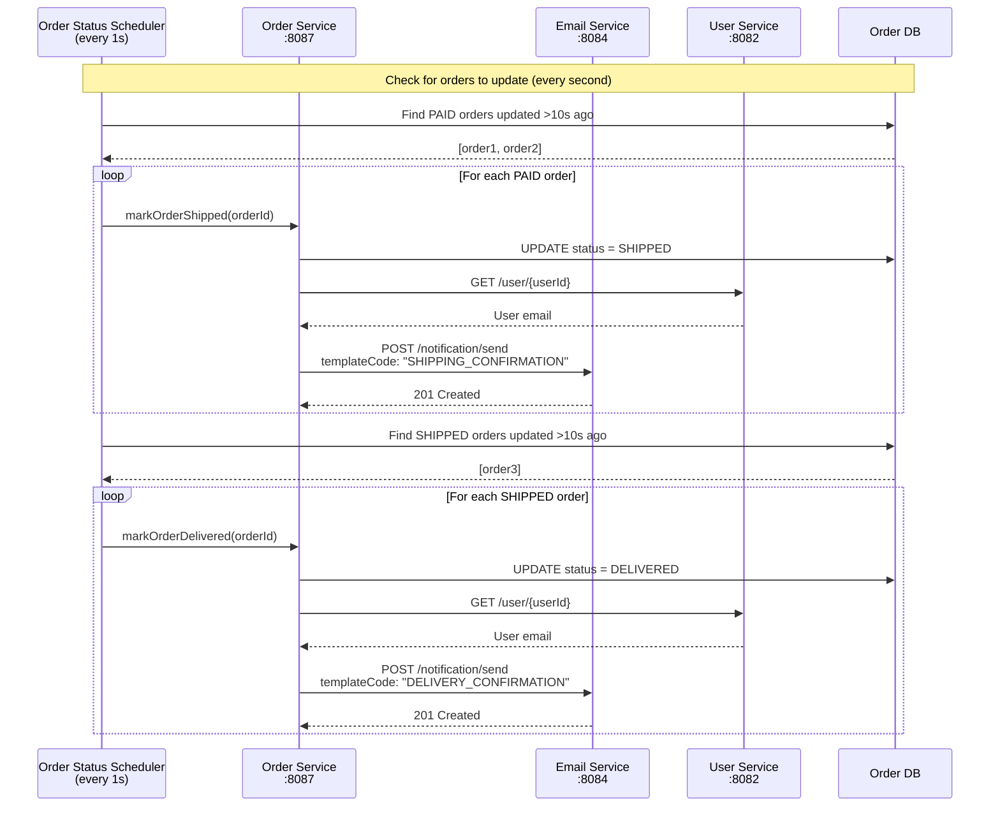

# Order Flow

## Overview

The order flow handles order creation, status management, and order history.

## Sequence Diagram



## Refund Flow (User-Initiated)



## Internal Status Updates (from Payment Service)



## Automatic Status Updates

The Order Service includes a scheduler that automatically transitions order statuses:



**Timeline:**
```
0s   - Order created (status: CREATED)
0s   - Payment processed (status: PAID) → Email: Payment Confirmation
10s  - Auto-updated (status: SHIPPED) → Email: Shipping Confirmation
20s  - Auto-updated (status: DELIVERED) → Email: Delivery Confirmation
```

## Error Handling

| Scenario | HTTP Code | Message |
|----------|-----------|---------|
| Order not found | 404 | "Order not found: {orderId}" |
| Invalid status transition | 409 | "Invalid status transition: {status}" |
| Missing required fields | 400 | "userId: required, totalAmount: required" |

## Service Communication

| From | To | Method | Endpoint | Purpose |
|------|-----|--------|----------|---------|
| API Gateway | Order Service | POST | /order | Create order |
| API Gateway | Order Service | GET | /order/{id} | Get order details |
| API Gateway | Order Service | PUT | /order/{id}/status | Update status |
| API Gateway | Order Service | GET | /order/user/{id} | List user orders |
| API Gateway | Order Service | POST | /order/{id}/refund | Refund order (orchestrated) |
| Order Service | Product Service | GET | /products/{id} | Get product details |
| Order Service | Payment Service | PUT | /payment/order/{id}/refund | Process refund |
| Order Service | User Service | GET | /user/{userId} | Get user email |
| Order Service | Email Service | POST | /notification/send | Send payment confirmation |
| Order Service | Email Service | POST | /notification/send | Send shipping confirmation |
| Order Service | Email Service | POST | /notification/send | Send delivery confirmation |
| Order Service | Email Service | POST | /notification/send | Send refund confirmation |
| Payment Service | Order Service | PUT | /order/{id}/paid | Mark as paid |

## Database Operations

| Operation | Table | Description |
|-----------|-------|-------------|
| INSERT | orders | Create new order |
| SELECT | orders | Get order by ID |
| SELECT | orders | Get orders by user ID |
| UPDATE | orders | Update order status |
