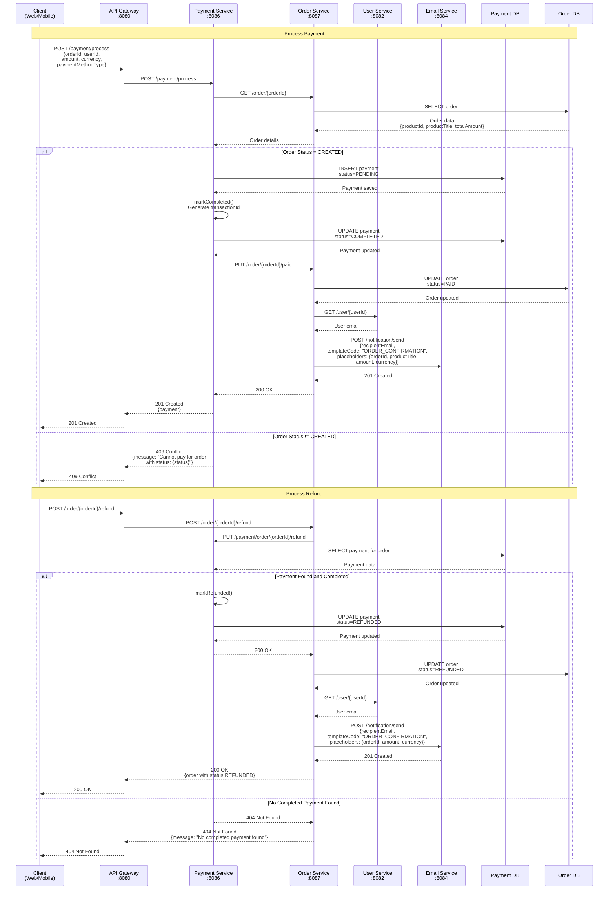
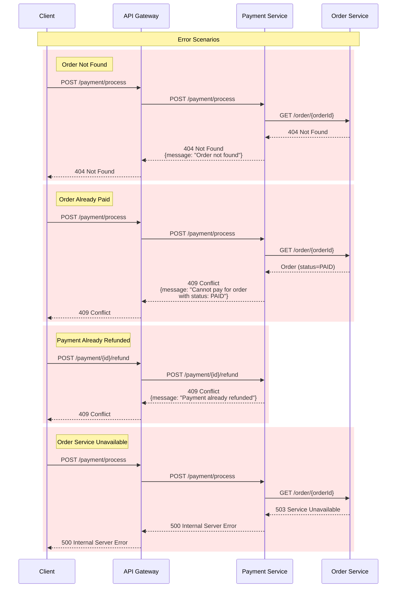
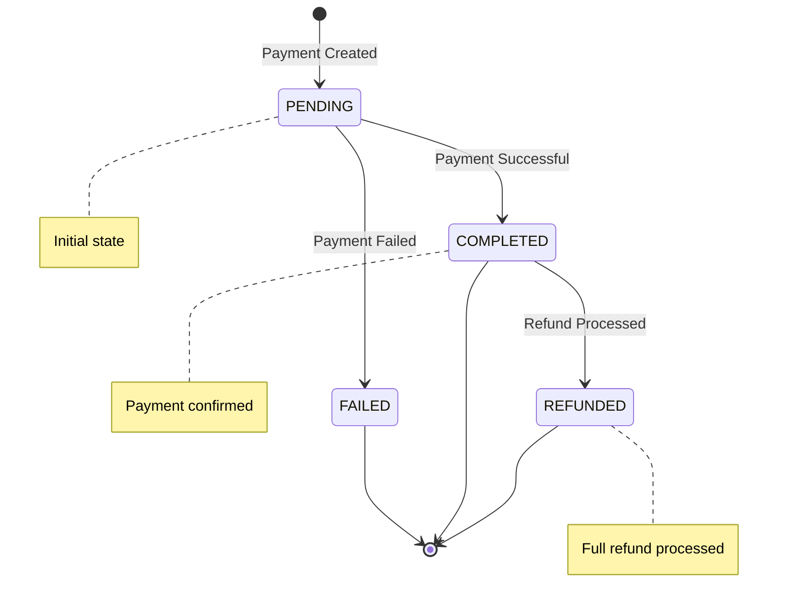

# Payment Flow

## Overview

The payment flow handles payment processing, refunds, and email notifications.

## Sequence Diagram

## Error Handling

## Payment States

## Service Communication

| From | To | Method | Endpoint | Purpose |
|------|-----|--------|----------|---------|
| API Gateway | Payment Service | POST | /payment/process | Process payment |
| API Gateway | Payment Service | GET | /payment/{id} | Get payment details |
| API Gateway | Payment Service | POST | /payment/{id}/refund | Refund payment (legacy) |
| API Gateway | Payment Service | GET | /payment/order/{orderId} | List payments for order |
| API Gateway | Order Service | POST | /order/{orderId}/refund | Refund order (orchestrated) |
| Payment Service | Order Service | GET | /order/{orderId} | Get order details |
| Payment Service | Order Service | PUT | /order/{orderId}/paid | Mark order as paid |
| Order Service | Payment Service | PUT | /payment/order/{orderId}/refund | Process refund |
| Order Service | User Service | GET | /user/{userId} | Get user email |
| Order Service | Email Service | POST | /notification/send | Send confirmation email |

## Database Operations

| Operation | Table | Description |
|-----------|-------|-------------|
| INSERT | payments | Create new payment |
| SELECT | payments | Get payment by ID |
| SELECT | payments | Get payments by order ID |
| UPDATE | payments | Update payment status |
